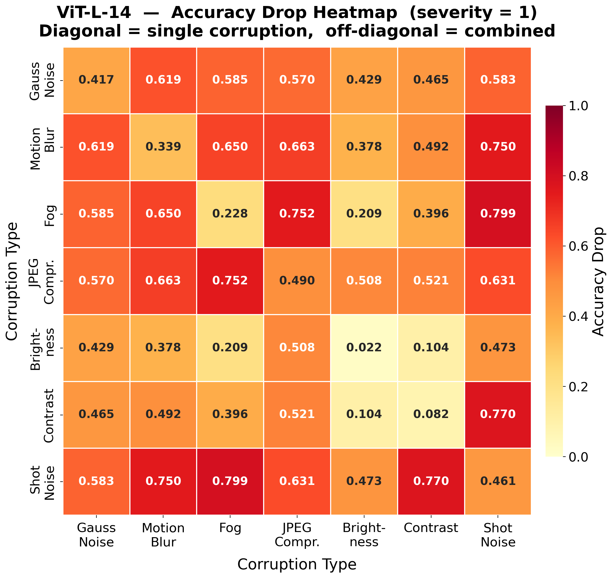
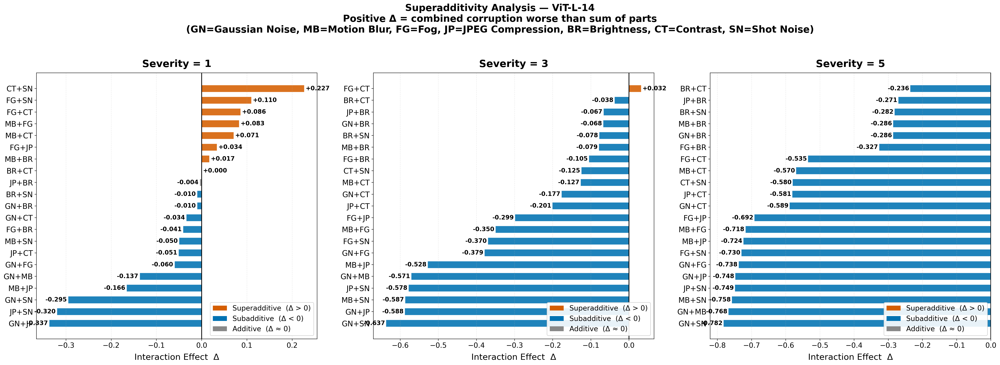
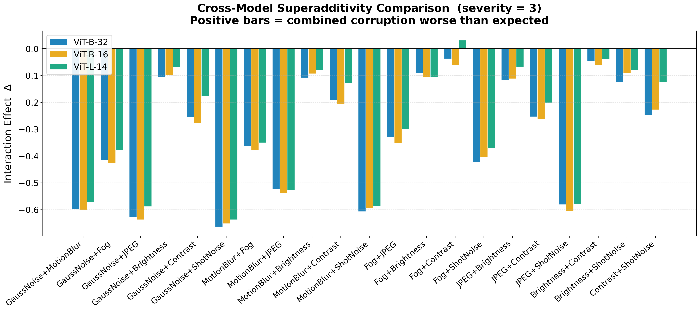
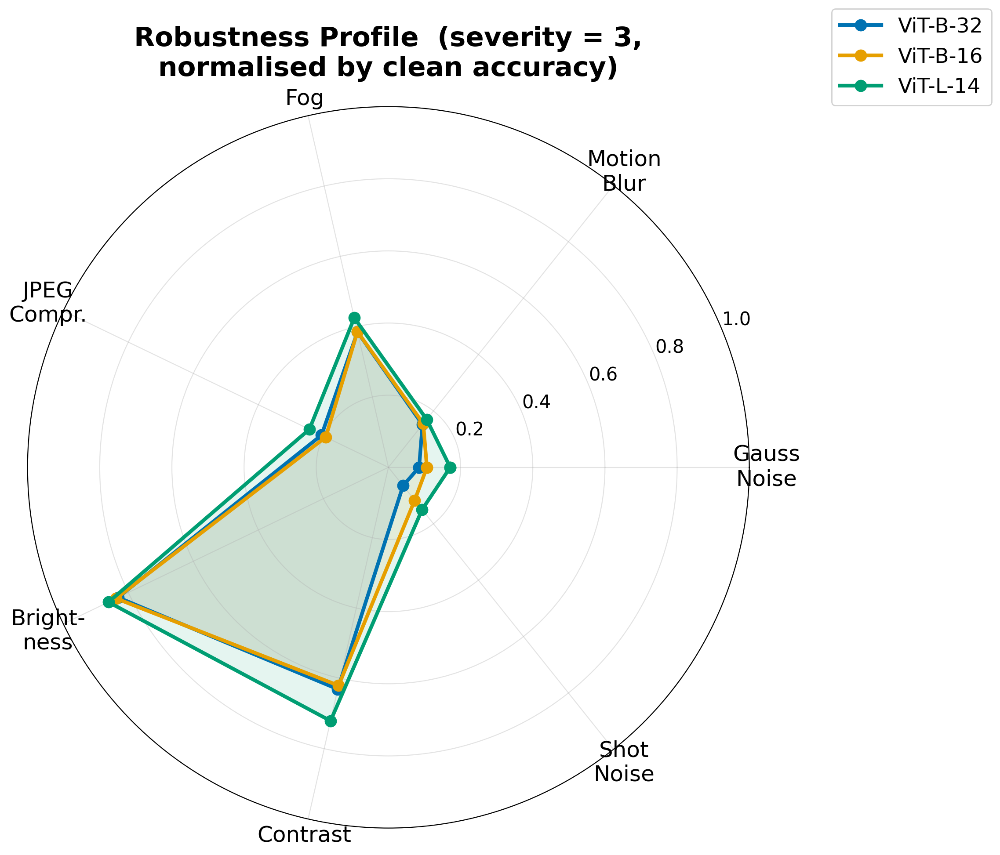
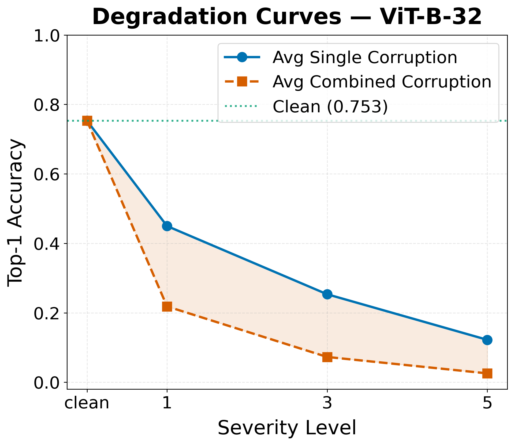
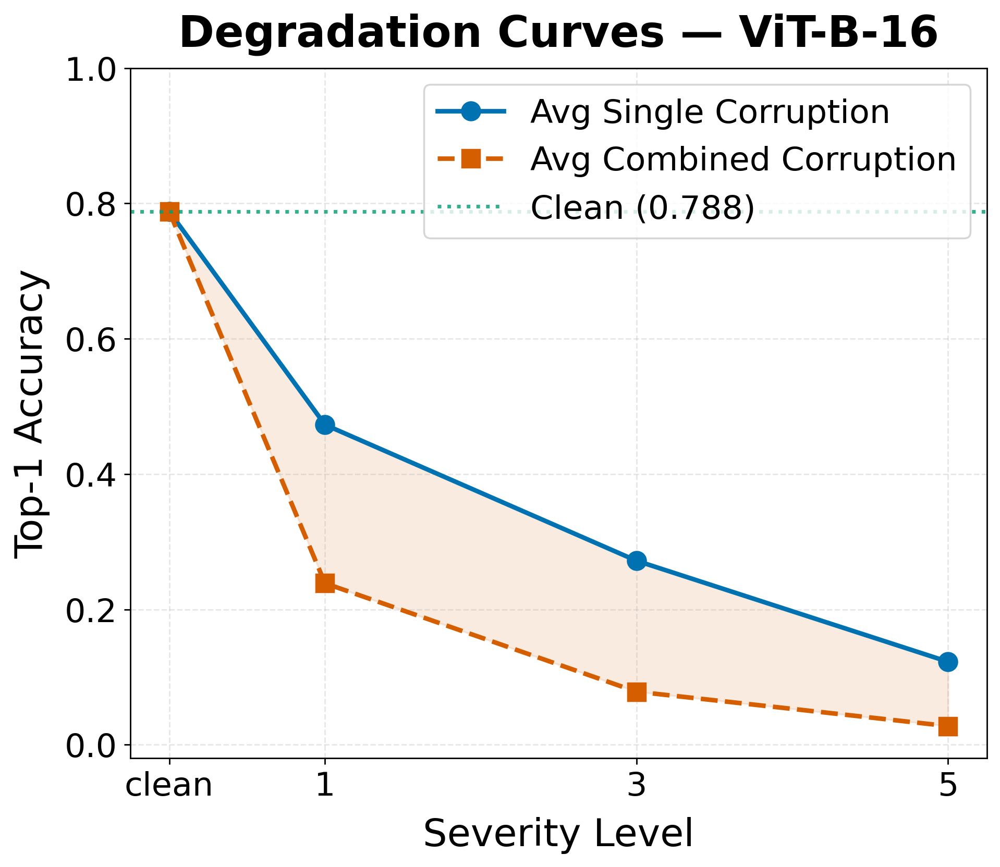
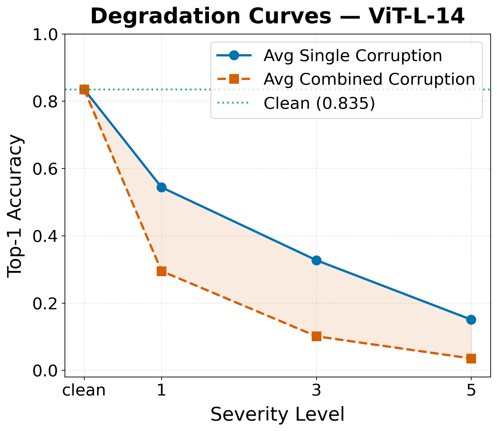
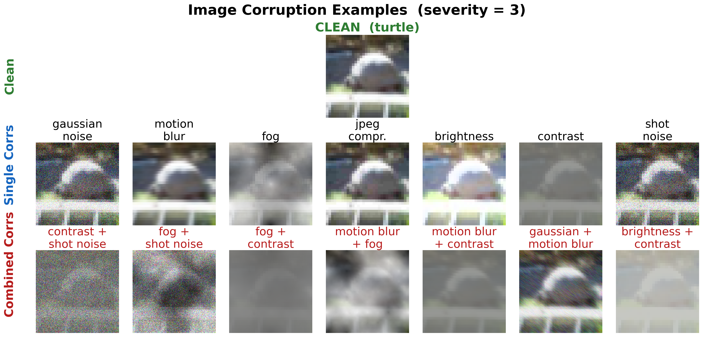

# 💥 When Corruptions Compound
## Superadditive Degradation of Vision-Language Encoders under Combined Image Corruptions

<div align="center">


**First systematic study of pairwise corruption interactions for CLIP-family encoders**

[🧠 Key Findings](#-key-findings) • [🚀 Quick Start](#-quick-start) • [📊 Results](#-results) • [📄 Paper](#-paper)

</div>

---

## 🧠 TL;DR

> Existing robustness benchmarks test corruptions **one at a time**.
> Real cameras don't. We test **all pairwise combinations** and find that
> some pairs are **catastrophically worse** than the sum of their parts.

```
fog alone:         acc = 0.528  (drop = 0.225)
shot_noise alone:  acc = 0.245  (drop = 0.508)
─────────────────────────────────────────────
expected combined: drop = 0.733  →  acc ≈ 0.020
actual combined:   drop = 0.799  →  acc = 0.023  🔴 SUPERADDITIVE (+0.110)
```

---

## 🎯 Key Findings

### 1️⃣ Superadditivity is Real

At low severity, **up to 8 of 21 pairs** degrade accuracy worse than
the sum of individual drops.

| Pair | Expected Drop | Actual Drop | Interaction Δ |
|------|:---:|:---:|:---:|
| **contrast + shot\_noise** | 0.543 | **0.770** | 🔴 **+0.227** |
| fog + shot\_noise | 0.689 | 0.799 | 🔴 +0.110 |
| fog + contrast | 0.330 | 0.419 | 🔴 +0.089 |
| gaussian + motion\_blur | 0.807 | 0.634 | 🔵 −0.173 |

### 2️⃣ Scale Does NOT Help

```
         Clean    Avg Combined (s=1)    Gap
ViT-B/32  0.753       0.218           0.231
ViT-B/16  0.788       0.239           0.234
ViT-L/14  0.835       0.295           0.249  ← BIGGER gap!
```

> Larger models have **more headroom to fail**.
> ViT-L/14 shows **2× stronger superadditivity** than ViT-B/32.

### 3️⃣ Order Matters — A Lot

```
fog → contrast:   acc = 0.356  ✅
contrast → fog:   acc = 0.146  💀
─────────────────────────────────
Δ_order = 0.210  ← worst-case gap
```

4 of 5 top pairs are **order-sensitive**.
Fixed-order benchmarks underestimate worst-case by up to **0.21 accuracy**.

### 4️⃣ Floor Effect at High Severity

| Severity | Superadditive pairs |
|:---:|:---:|
| s=1 | 🔴 6–8 pairs |
| s=3 | 🟡 0–1 pairs |
| s=5 | ⚪ 0 pairs |

### 5️⃣ Patch Size Trade-off

| Model | Gaussian Noise s=1 | JPEG s=1 |
|-------|:---:|:---:|
| ViT-B/**32** (large patch) | 0.276 | **0.290** |
| ViT-B/**16** (small patch) | **0.341** | 0.279 |

> Small patches → better noise robustness, worse JPEG robustness.

---

## 📊 Results

### Accuracy Drop Heatmap (ViT-L/14, severity=1)

<div align="center">


*Diagonal = single corruption. Off-diagonal = combined.
Darker red = more severe degradation.*
</div>

---

### Superadditivity Analysis

<div align="center">


*Red = superadditive (Δ > 0). Blue = subadditive (Δ < 0).*
*GN=Gaussian Noise, MB=Motion Blur, FG=Fog,
JP=JPEG, BR=Brightness, CT=Contrast, SN=Shot Noise*
</div>

---

### Cross-Model Comparison

<div align="center">


*ViT-L/14 (green) consistently shows the strongest superadditive effects.*
</div>

---

### Robustness Profiles

<div align="center">


*All models share the same corruption hierarchy →
architecture-invariant structural vulnerability.*
</div>

---

### Degradation Curves

<div align="center">

| ViT-B/32 | ViT-B/16 | ViT-L/14 |
|:---:|:---:|:---:|
|  |  |  |

*Blue = single. Red = combined. Gap narrows at high severity (floor effect).*
</div>

---

### Corruption Examples

<div align="center">

</div>

---

## 🚀 Quick Start

### Всё в одном ноутбуке!

```
📄 Research_Kudinov_ruslan.ipynb
```

Просто открой ноутбук и запускай ячейки по порядку.

### Структура ноутбука:

| # | Блок | Время |
|---|------|:-----:|
| 1 | Установка зависимостей | ~2 мин |
| 2 | Патчи NumPy 2.0 | мгновенно |
| 3 | Загрузка данных (CIFAR-100) | ~1 мин |
| 4 | Загрузка моделей (3× OpenCLIP) | ~5 мин |
| 5 | **Основной эксперимент** | ~111 мин |
| 6 | Анализ и визуализация | ~2 мин |
| 7 | Ablation: order sensitivity | ~5 мин |
| 8 | Перегенерация графиков | ~2 мин |

### Установка зависимостей:

```bash
pip install open_clip_torch imagecorruptions torch torchvision \
    matplotlib seaborn pandas numpy tqdm datasets Pillow
```

### Важный патч (первая ячейка ноутбука):

```python
import numpy as np
if not hasattr(np, 'float_'):    np.float_ = np.float64
if not hasattr(np, 'int_'):      np.int_ = np.int64
if not hasattr(np, 'complex_'):  np.complex_ = np.complex128
```

> ⚠️ **GPU рекомендуется.** Без GPU эксперимент займёт значительно дольше.

---

## 📁 Структура проекта

```
📦 RealResearch/
│
├── 📓 Research_Kudinov_ruslan.ipynb   ← ВСЕ ЭКСПЕРИМЕНТЫ ЗДЕСЬ
│
├── 📄 paper.tex                       ← LaTeX статья
├── 📄 references.bib                  ← Список литературы
├── 📄 paper.pdf                       ← Скомпилированная статья
│
└── 📁 results_combined_corruptions/   ← Генерируется автоматически
    ├── 📄 raw_results.json            ← Все числа
    ├── 📄 summary_table.tex           ← Таблица для LaTeX
    ├── 📄 ablation_order.csv          ← Абляция порядка
    ├── 🖼️ corruption_examples.png
    ├── 🖼️ heatmap_ViT-*_s{1,3,5}.png  (9 файлов)
    ├── 🖼️ severity_curves_ViT-*.png   (3 файла)
    ├── 🖼️ superadditivity_ViT-*.png   (3 файла)
    ├── 🖼️ cross_model_superadditivity.png
    └── 🖼️ radar_robustness.png
```

---

## 🔬 Методология

### Модели (OpenCLIP, LAION-2B)

| Модель | Patch Size | Параметры |
|--------|:---:|:---:|
| ViT-B/32 | 32×32 | 88M |
| ViT-B/16 | 16×16 | 86M |
| ViT-L/14 | 14×14 | 307M |

### Коррупции

| Категория | Типы |
|-----------|------|
| 🔴 Noise | `gaussian_noise`, `shot_noise` |
| 🟠 Blur | `motion_blur` |
| 🟡 Weather | `fog` |
| 🟢 Digital | `jpeg_compression`, `brightness`, `contrast` |

**21 пара** из $\binom{7}{2}$ комбинаций × **3 severity** × **3 модели** = **765 evaluations**

### Метрика Interaction Effect

$$\mathcal{I}(c_1, c_2, s) = \Delta(c_1{+}c_2,\, s) - [\Delta(c_1, s) + \Delta(c_2, s)]$$

```
I > +0.005  →  SUPERADDITIVE  🔴
|I| ≤ 0.005 →  ADDITIVE       ⚪
I < -0.005  →  SUBADDITIVE    🔵
```

---

## 📄 Paper

Статья написана в LaTeX, компилируется через MiKTeX:

```bash
pdflatex paper
bibtex paper
pdflatex paper
pdflatex paper
```

---

## ⚙️ Железо и время

| Этап | Время |
|------|:-----:|
| Полный эксперимент (3 модели) | ~111 мин 🕐 |
| Перегенерация графиков | ~2 мин ⚡ |
| Абляция (order sensitivity) | ~5 мин |
| Компиляция статьи | ~30 сек |

---

## 🔑 Что нового по сравнению с существующими работами

| Работа | Что делали | Наше отличие |
|--------|-----------|--------------|
| ImageNet-C (2019) | Одиночные коррупции | **Попарные комбинации** |
| RobustBench (2021) | Лидерборд одиночных | **Interaction effects** |
| CCC / RDumb (2023) | Пары для TTA на CNN | **VLM, zero-shot** |
| BAT-CLIP (2024) | Одиночные на CLIP | **Комбинированные** |
| Holistic CLIP (2024) | 3D коррупции на CLIP | **Порядок + суперадд.** |

> ✅ Никто до нас не изучал попарные interaction effects
> для VLM энкодеров в zero-shot классификации.

---

<div align="center">

**Kudinov Ruslan** • 2025

Made with 🔥 and way too much ☕

</div>
